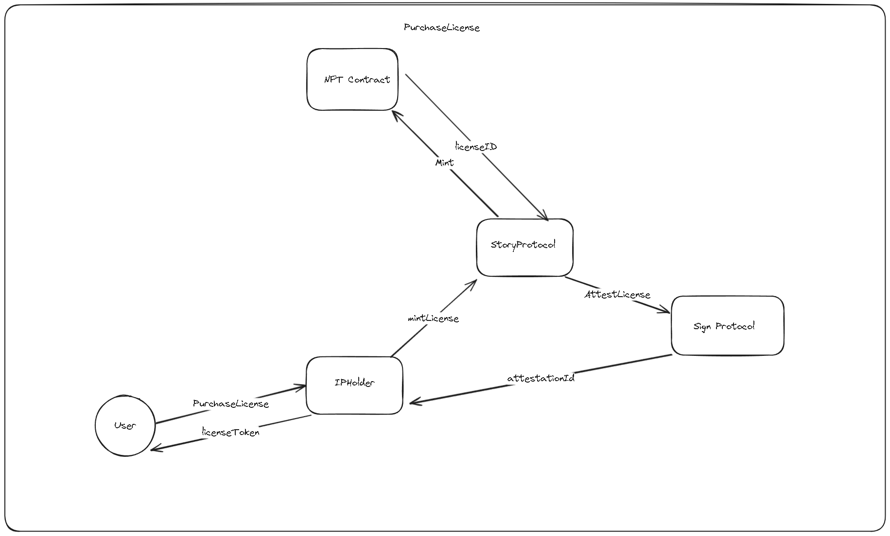
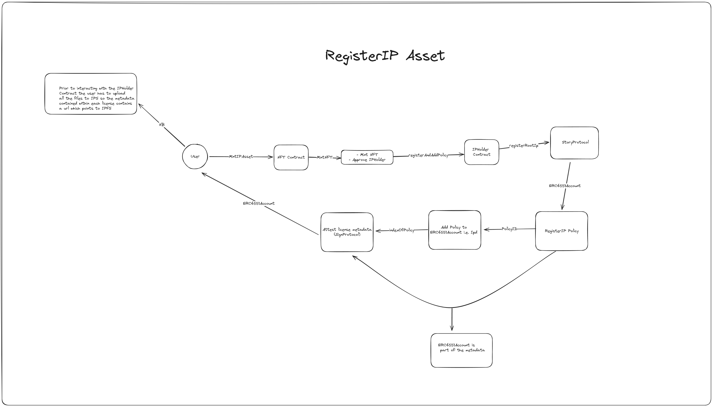

# IPME Document

## Overview

IPME is a (DApp) that integrates the Story Protocol for managing and licensing intellectual properties with the Sign Protocol for attesting to the authenticity of the Licensing terms.

## Components

### 1. Story Protocol Integration

**Functionality**:

- Allows creators to register their intellectual property as NFTs.
- Creators can attach files such as images and PDFs which serve as additional data for anyone who purchases a license
- Creators can set and encode licensing terms directly into these NFTs.

### 2. Sign Protocol Integration

**Functionality**:

- Attestations are used to verify the authenticity of the IP and the integrity of transaction terms.
- Each licensing transaction is attested using the sign protocol, the data for each attestation is attached to each IP and I used to attest that the license being issued matches the terms of the IP Asset.

### 3. ERC-6551 Utilization

**Functionality**:

- Each IP Asset NFT is linked to an <a href=https://www.quicknode.com/guides/ethereum-development/nfts/how-to-create-and-deploy-an-erc-6551-nft>ERC-6551</a> account, enabling it to hold and transfer other tokens.
- This capability allows each NFT to manage its financial transactions related to licensing fees, royalties, and other related payments.

## Workflow

### IP Asset Creation and Registration

1. **Creator Onboarding**:

   - Creators connect their metamask wallet.
   - Creators can deploy an IPHolder contract which allows them to mint IP Assets
   - Once the contract is deployed they can Mint new IP Assets (ERC-6551 Account)

2. **IP Asset Setup**:

   - Creators upload content and fill in details about the IP such as the Name and any description and the minimum cost for anyone to purchase a license.
   - Any files attached to the IP are then uploaded to Filecoin.
   - Once all the fields have been filled in the User can then send the transaction to the IPHoldler contract to mint and register the IP Asset on the story protocol
   - Each IP Asset registered under <a href=https://docs.storyprotocol.xyz/docs/pil-flavors-preset-policy> Non-Commercial Social Remixing</a>

3. **NFT Minting and ERC-6551 Account Setup**:
   - An NFT representing the IP asset is minted.
   - Concurrently, an ERC-6551 account specific to this NFT is automatically set up via the Story Protocol.

### Licensing and Transactions

4. **Licensing Terms Attestation**:

   - Creators use the Sign Protocol to attest to the established licensing terms.
   -  This occurs whenever a creator mints a new IP Asset
   -  The licensing terms are then attached to the IP metadata 
   - Which are then used to attest to the Sign Protocol

5. **License Acquisition**:

   - Licensees browse available IP assets and their terms.
   - Each license acquisition cost an amount specified by the creator during the minting process
   - The creator can specify a Payment Token but for the hackathon, I have hardcoded this

6. **Payment Processing and Attestation**:
   - Payments are made directly to the ERC-6551 account associated with the IP Asset.
   - The owner of the IP Asset can withdraw these funds 
   - Paying for a license can be made using any ERC20 token specified by the creator

## Diagrams
1. 
2. 

## Additional links
- https://docs.storyprotocol.xyz/docs/what-is-story-protocol
- https://docs.sign.global/

